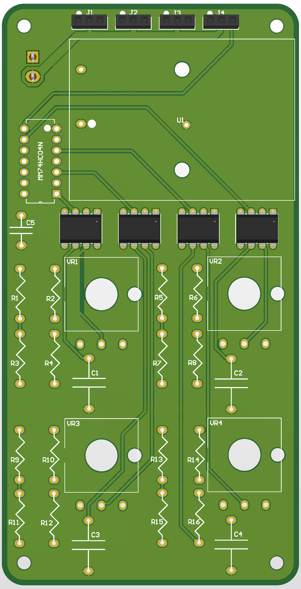

# Mini Robotic Arm Kit
## Purpose:
The purpose of this repository is to provide design files and instructions for a fun entry-level project to engineering and electronics, in this case a robotic arm. UNFINISHED

## Mechanics:
### The Arm:
The arm was found on Instructables and designed by theGHIZMo, website http://www.eezyrobots.it/. The base was redesigned to fit our PCB, and the claw was redesigned to be more functional. Instructions and STL files can be found here: https://www.instructables.com/EEZYbotARM/

### The Claw: 
The claw was designed in-house.
##### Contributors:
[@crazyblock12](https://github.com/crazyblock12)

## Electronics:
### The PCB:
  

### Optimization of PWM:

